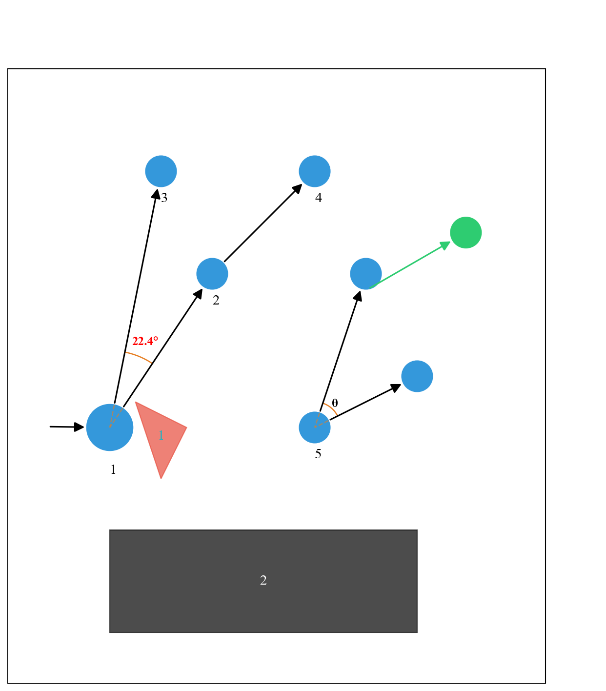

# RRT 可视化工具库

[](https://www.python.org/)
[](LICENSE)

用于快速生成RRT（快速随机树）算法示意图的Python可视化工具，支持多种树结构绘制和丰富的样式配置。



## 🌟 核心特性

- **多元素绘制**：支持节点、路径、障碍物、角度标注等要素的可视化
- **样式可配置**：通过`RRTStyleConfig`类实现全局样式统一管理
- **树结构支持**：
  - 经典树结构

- **自动化标注**：节点/边自动编号、障碍物反色标签
- **几何计算**：内置线段关系计算、角度标注等实用工具

## 📦 安装

```bash
# 安装基础依赖
pip install matplotlib numpy

# 完整安装（包含实验性功能）
pip install matplotlib numpy networkx ompl
```


### 环境配置
``` python
# 环境配置
# 环境安装：
pip install -r requirements.txt

```

### 导出依赖
``` bash
pip freeze > requirements.txt
```

### 进入虚拟环境（可选）
``` bash
Set-ExecutionPolicy -ExecutionPolicy Bypass -Scope Process # 临时允许执行脚本(部分环境需要先执行这一行指令)
.\venv\Scripts\activate # Windows激活
source venv/bin/activate # Linux激活
```

### 🚀快速开始
``` python
import numpy as np
from plotter import RRTPlotter, RRTStyleConfig

# 初始化带自定义样式的绘图器
style = RRTStyleConfig()
style.update_style('node', color='#3498db', radius=0.3)
plotter = RRTPlotter(figsize=(12, 10), style_config=style)

# 添加路径段
plotter.add_path_segment(
    start=(2, 3),
    angle=np.radians(45),
    length=5,
    color='#2ecc71'
)

# 添加障碍物
obstacle_vertices = np.array([[4,4], [5,5], [4.5,6]])
plotter.add_labeled_obstacle(obstacle_vertices, label_visible=True)

# 保存结果
plotter.save('rrt_demo.png', dpi=300)
plotter.show()
```

### 🛠️ 核心API概览

```python
class RRTPlotter:
    def __init__(self, figsize=(10, 8), style_config=None):
        # 初始化绘图器

    def add_node(self, position, color='#3498db', radius=0.3, label=None, label_visible=True):
        # 添加节点

    def add_path_segment(self, start, angle, length, color='#2ecc71', label=None, label_visible=True):
        # 添加路径段

    def add_labeled_obstacle(self, vertices, color='#e74c3c', label_visible=True):
        # 添加带标签的障碍物
```

### RRTPlotter 类

| 方法	| 功能描述 |
| --- | --- |
|add_circle_node()	|添加带自动编号的圆形节点|
|connect_nodes()	|连接两个节点并绘制箭头|
|draw_rrt_tree()	|自动绘制RRT树结构|
|add_angle_annotation()	|标注两路径间的夹角|
|radial_extension()	|沿指定角度扩展路径|
|save()/show()	|保存/显示可视化结果|
